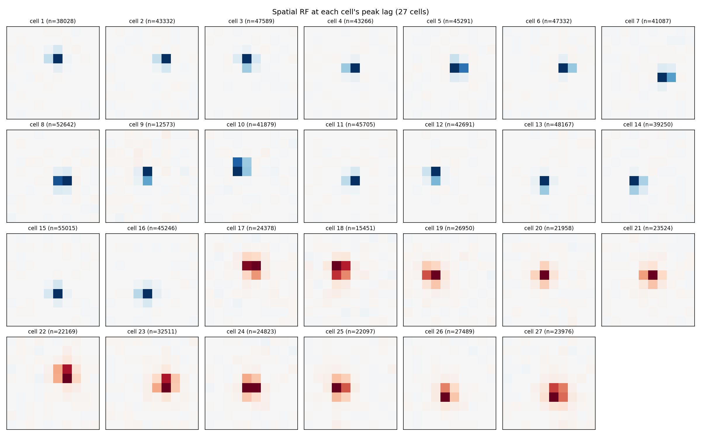

# Modeling a Real Retinal Ganglion Cell

Three models of the same real neuron — a classical linear filter (LNP), a spatiotemporal CNN, and a simulated analog circuit — each predicting spiking from the same stimulus, validated against the neuron's real, repeat-averaged response.

**Live interactive demo:** https://retina-rgc-surrogate.vercel.app

## Dataset

27 real primate retinal ganglion cells recorded by Chichilnisky & Pillow while the retina watched 20 minutes of 10×10 binary spatiotemporal white noise (`Pillow et al., Nature 2008`). A held-out 10-second movie, repeated 600 times, provides a real, trial-averaged PSTH for validation — never used for fitting.

- `Stim_reduced.mat`: training stimulus, `(144000, 100)` — 144,000 frames at 120 Hz, 100 = 10×10 pixels
- `SpTimesRGC.mat`: spike times per cell, in frame-index units
- `Stim_reducedRpt.mat` / `MtspRGCrpt.mat`: the 10 s repeat stimulus and 600-trial spike data used for validation

## Phase 1 — Spike-triggered average (baseline)

`compute_sta.py` / `sta_all_cells.py` compute the STA for all 27 cells. The population splits cleanly into 16 OFF-type and 11 ON-type cells with no tuning required — a real biological signature falling directly out of the data.



## Phase 2 — Two predictive models (both paths built, not just one)

**LNP baseline** (`lnp_baseline.py`, `lnp_all_cells.py`): the STA as a linear filter + a fitted static nonlinearity. Mean correlation with the real PSTH across all 27 cells: **r = 0.864**.

**Path B — CNN** (`cnn_model.py`, `cnn_evaluate.py`): a small spatiotemporal CNN trained on all 27 cells jointly (Baccus/Ganguli-style). Mean r = **0.866** — essentially tied with the LNP baseline. This is an expected, informative result: the stimulus is i.i.d. white noise, which gives a black-box model nothing to exploit beyond what a linear filter already captures. A CNN's real advantage over LNP shows up on natural/structured movies, not flicker noise.

**Path A — equivalent circuit** (`make_circuit_netlist.py`, `tune_circuit.py`, `circuit_evaluate.py`): a real analog circuit for cell 1, simulated in ngspice — a spatial summing network sized from the STA's spatial slice, two RC cascades forming the STA's biphasic temporal filter, and a leaky integrate-and-fire stage (a real RC integrator + a self-resetting switch — a genuine relaxation-oscillator neuron circuit). Final result: **r = 0.582** vs. the real PSTH.

Two real bugs were found and fixed during development (documented in the git history): a scale mismatch between the real RC cascade's physical impulse response and the idealized kernel used for fitting, and a rank-1 sign-doubling bug in the separable spatial × temporal STA approximation that initially inverted the whole filter (r = -0.28 before the fix).

## Phase 3 — Validation against the real PSTH

| Model | r vs. real PSTH (cell 1) |
|---|---|
| LNP | 0.906 |
| CNN | 0.884 |
| Equivalent circuit | 0.582 |

The circuit scores lower because it uses only a rank-1 (single spatial pattern × single temporal pattern) approximation of the full STA — a real cost of requiring the model to exist as an actual buildable circuit rather than an arbitrary matrix.

## Repository structure

```
retina_lib.py              shared data loading + STA computation
compute_sta.py              single-cell STA (Phase 1 milestone)
sta_all_cells.py            STA for all 27 cells
lnp_baseline.py / lnp_all_cells.py   LNP model + PSTH validation
cnn_model.py / cnn_evaluate.py       CNN model + PSTH validation
make_circuit_netlist.py / tune_circuit.py / circuit_evaluate.py   Path A circuit
export_web_data.py          exports data for the interactive demo
webapp/                     interactive site (deployed to Vercel)
```

## Running it

```bash
python3 sta_all_cells.py
python3 lnp_all_cells.py
python3 cnn_model.py && python3 cnn_evaluate.py
python3 make_circuit_netlist.py && python3 circuit_evaluate.py
```
